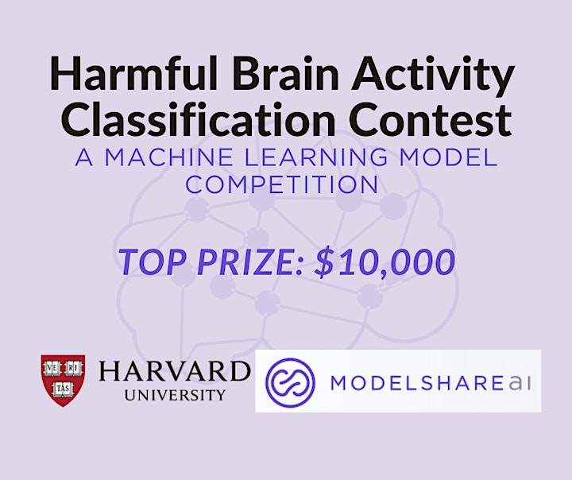
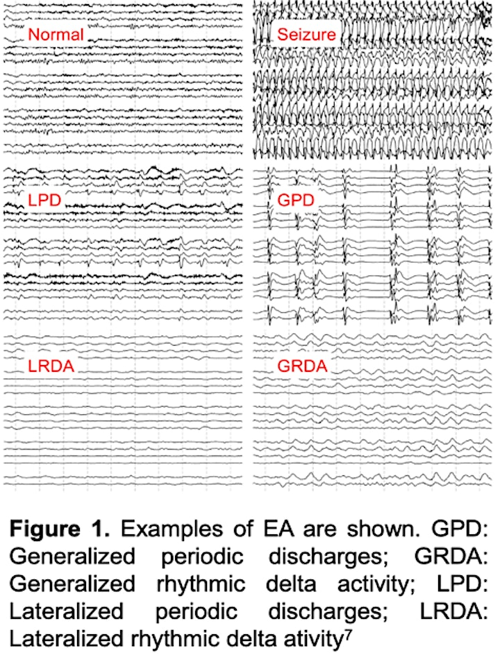
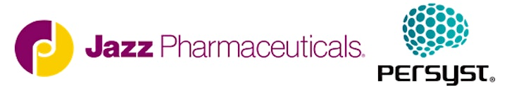

    

## 1. Competition Details

The goal of this competition is to detect and classify seizures and other types of harmful brain activity in <u> electroencephalography (EEG)</u> signals recorded from patients in the hospital who are critically ill. Your work will help doctors and brain researchers detect seizures and other types of electrical activity in the brain that can cause brain damage. The algorithms developed in this contest may also help researchers who are working to develop drugs to treat and prevent seizures. Examples of the types of brain activity you will be aiming to classify are shown in **Figure 1**.

Analysis of non-invasive EEG data is a key part of caring for patients who are critically ill. EEG monitoring is also used in the development of drugs designed to treat or prevent seizures, and for monitoring the safety of new drugs under development that might place patients at risk for seizures. Such EEG data is typically recorded continuously for multiple hours or days, and subsequently interpreted by manual review of the EEG data by physician experts trained in neurology with subspecialized training in epilepsy. This approach is not only expensive and time consuming but is also prone to error because of problems with inter-rater reliability and data fatigue.

A machine learning model that can accurately detect and classify harmful patterns of brain automatically at a level of accuracy matching or exceeding that of typical experts could make the interpretation of clinical data and clinical trial data faster, less expensive, and more reliable.

We have developed a large set of EEG data labeled by multiple clinical experts and created one machine learning model that performs this task. Your challenge in this competition is to build an even better algorithm! **Models will be submitted through ModelShareAI** (https://www.modelshare.ai/).

The algorithms that you contribute in this contest may help neurology researchers better understand which types of seizures injure the brain and how, and may enable doctors to detect and treat seizures more quickly. Your algorithms will also help companies to make safer and more effective drugs for epilepsy and other neurologic diseases.

##### Examples of EA:

##### Citations:

> *Interrater Reliability of Expert Electroencephalographers Identifying Seizures and Rhythmic and Periodic Patterns in Electroencephalograms. Neurology. 2022 Dec 2:10.1212/WNL.0000000000201670. doi: 10.1212/WNL.0000000000201670. Epub ahead of print. PMID: 36460472.*

> *Development of Expert-Level Classification of Seizures and Rhythmic and Periodic Patterns During EEG Interpretation. Neurology. 2023 Mar 6:10.1212/WNL.0000000000207127. doi: 10.1212/WNL.0000000000207127. Epub ahead of print. PMID: 36878708.*

## 2. Data Sets

The Brain Data Science Platform (BDSP) Seizure Dataset is the world’s largest collection of EEG recordings annotated by multiple clinical experts. The dataset was developed as part of an NIH R01 grant (R01NS107291). The dataset has not-yet been publicly released, which is ideal for the present competition.

The dataset includes 6,095 noninvasive EEGs recordings from 2,711 distinct patients. The dataset contains 71,982 ten-second-long EEG segments that have been independently annotated by 20 fellowship-trained neurophysiologists. This intensive labeling by multiple clinical experts allows robust evaluation of the degree to which machine learning algorithms match expert performance.

The data is raw in micro-volts with sampling rate of 200Hz, having 20 channels in the order of (Fp1, F3, C3, P3, F7, T3, T5, O1, Fz, Cz, Pz, Fp2, F4, C4, P4, F8, T4, T6, O2, and EKG). For each EEG sample, the expert label applies only to the central 10-second data; we also provide 20-second EEG before and after as context. Besides, a regional-average 10-minute spectrogram is also available centered at the same time of EEG to provide more information in case teams also find this data useful for model training.

For the competition, the data will be split into <u>three parts</u>.

1. **Labeled and unlabeled model training data**: One part of the data will be made available to participants with the accompanying labels, for model training. We are also making available a large amount of unlabeled data in case teams also find this data useful for model training. No experts have labeled this part of the data, and this data will not be used in evaluating models.
2. **Hidden testing data, Part 1**: The second part of the data has labels that will remain hidden from participants. Participants will have access to this data, but not the labels. Participants will submit predicted labels for these the hidden test data. We will compare your predicted labels with the expert labels (behind the scenes) to calculate two F1 scores (see below) based on different subsets of the data. One of these scores will be displayed on the public leaderboard. The other score will available only to the contest judges on a private leaderboard. You will not know which subset of the hidden test data is used to calculate the private vs the public leaderboard score.
3. **Hidden testing data: Part 2**: At the close of the competition, we will select the top 10 algorithms based on the private leaderboard. We will evaluate these models on a third set of data, “Hidden testing data: Part 2.” This will be a rigorous test of your model’s ability to generalize to never-before-seen data. We will calculate the F1 score of each of the 10 final models on this final set of hidden data. The models with the 3 best scores on this hidden data will be named as the contest winners.

## 3. Performance Metrics

**We will judge models based on the F1-score metric (The Macro Avg. F1-score) across 6 categories of EEG patterns.** The categories are seizures (SZ), generalized periodic discharges (GPDs), lateralized periodic discharges (LPDs), lateralized rhythmic delta activity (LRDA), generalized rhythmic delta activity (GRDA), and “other”. You can find your current F1-score in the public competition leaderboard. Users can track their position throughout the competition using the public <a href="https://www.modelshare.ai/detail/model:3691">Leaderboard</a>. Note however that models will be evaluated using the held out private leaderboard (see Data Sets section above). The public leaderboard and private leaderboard represent separate test datasets we use for evaluation purposes. As explained above, the 10 models with best private leaderboard scores will be further evaluated on a held out set of data that was not available during the competition. To win medals you will be required to share your model code with each submission to the leaderboard.

Note on how we evaluate models using the F1-score:

1. **You must share how you built your model with each leaderboard submission to win.** We make this easy for you in our example submission notebooks. When you submit your model using Sklearn, Tensorflow/Keras, or Pytorch models with reference to our example ipynb notebook, we make every effort to automatically extract how you built your model and when auto-extraction is successful no other information needs to be shared. If you submit model predictions only, then you need to navigate to the “code” tab of the modelshare.ai competition page and upload a notebook detailing how you built your model.
2. **All medals will be awarded based on the held out private leaderboard, and the “Hidden testing data: Part 2” (described above).** For any two or more submissions that submit the same model architecture and generate the same F1-score, only the first model submitted is considered for a medal. (You cannot simply copy and submit someone else's model and receive credit.)
3. **To win the competition, your results must be reproducible by others.** To test this, if your model is among the top 10 models at the time the leaderboard closes, you will be required to submit not only code to run your model, but also to retrain the model from scratch using the data that was available during the competition. We will run your training code. This code must stop automatically; it cannot require manual supervision. The resulting model will be the one that we test on the “Hidden testing data: Part 2.”

## 4. Prizes

Individual first, second, and third place will be determined based on the final top three submissions on the private leaderboard at the end of the competition.

Prizes will be:

- 1st Prize: $10,000

- 2nd Prize: $5,000

- 3rd Prize: $2,500

**Participants can submit up to five models to the leaderboard per day.** For any two or more submissions that submit the same model architecture and generate the same F1-score, only the first model is considered. The winning algorithms will be published open source on BDSP website under an MIT license and will be available to the research community for use.

<u>Winning teams will have an opportunity to present their work to an online symposium organized by Drs. Jing, Ge, Sun and Westover, to be held in August 2023.</u> We are looking into the opportunity of inviting the winning teams to submit a paper for publication in a scientific journal, describing their approach; details will be posted here as they become available.

## 5. Sponsors

The competition is made possible by the generous support of our two sponsors:

- Jass Pharmaceuticals: <a href="https://www.jazzpharma.com/">https://www.jazzpharma.com/</a>

- Persyst: <a href="https://www.persyst.com/">https://www.persyst.com/</a>

## 6. Organizers
 


